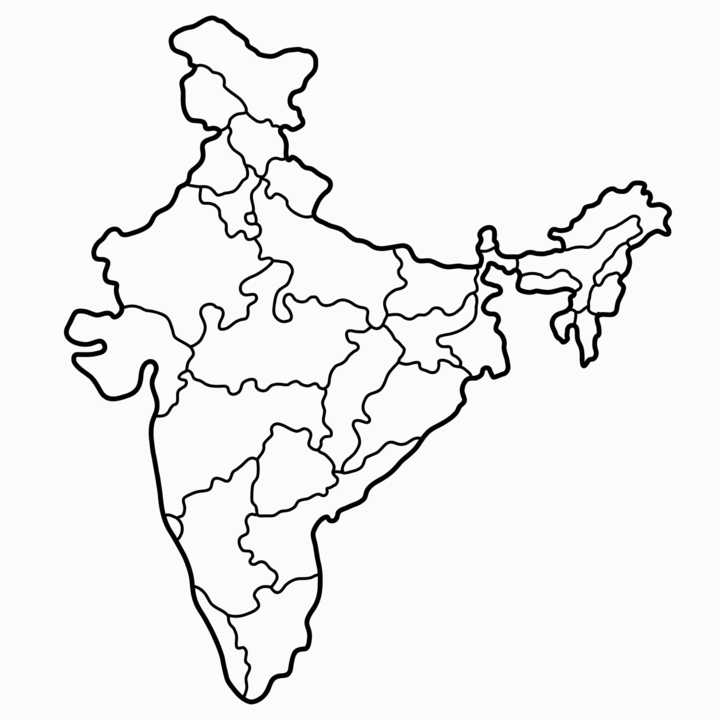

# India State Mapper

This project allows users to interactively guess and map Indian states using Turtle graphics in Python. The application reads state coordinates from a CSV file and displays an India map where users can input state names to guess their locations. It marks correctly guessed states on the map with a blue marker.
## Online Play

You can also play with this interactive India State Mapper online using Replit:

[](https://replit.com/@nikhilconnectno/India-State-Mapper)

Click the badge above or visit the link to start playing online.



## How to Use

1. **Clone the repository:**

   ```bash
   git clone https://github.com/Nikhilconnectnow/India-State-Mapper.git
   cd India-State-Mapper
   ```

2. **Install dependencies:**

   Make sure you have Python installed. You will also need pandas library for CSV handling:

   ```bash
   pip install pandas
   ```

3. **Run the application:**

   Run the Python script `main.py`:

   ```bash
   python main.py
   ```

   The map will display, and you can start guessing the states.

4. **Guess the states:**

   Enter the names of Indian states when prompted. The program will mark correctly guessed states with their names in blue on the map.

5. **Exit:**

   To exit the game, type "exit" when prompted for a state name or after guessing all states.


## Notes

- The map is based on coordinates stored in `data.csv`. Ensure this file is present and correctly formatted for the program to work.
- The program uses Turtle graphics for visualization, allowing interactive marking of guessed states on the map.

Feel free to contribute to improve the game or add more features!
